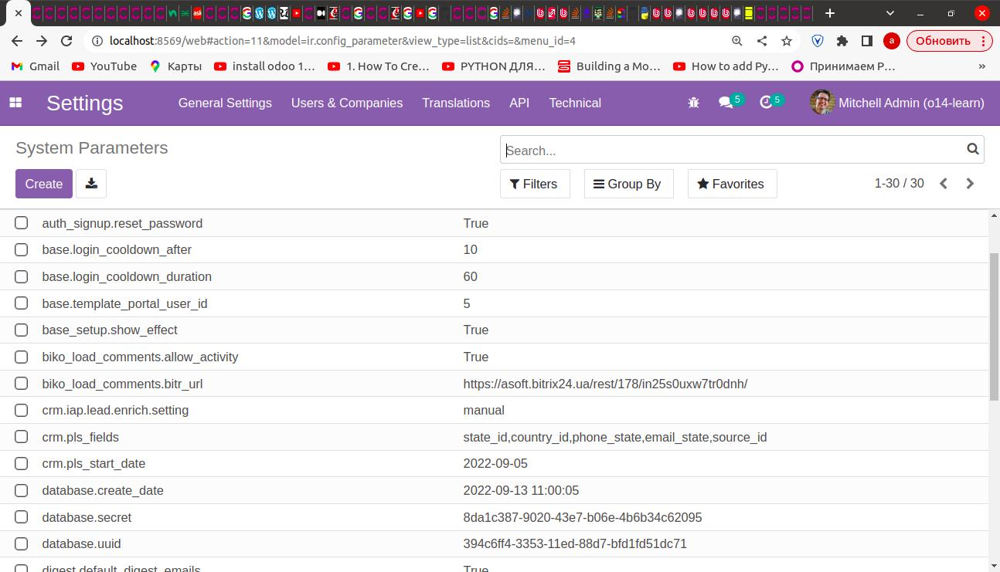
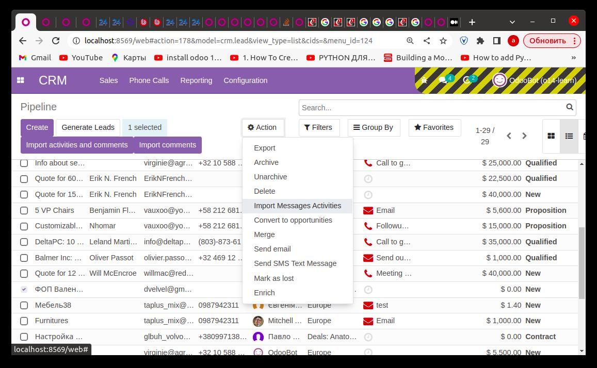

## BIKO: Import comments to opportunities

Configuration
=============

To configure this module, you need to:

* Go to Settings / Technical / System Parameters

* Set Bitrix REST webhook parameter: biko_load_comments.bitr_url
* Set parameter: 	biko_load_comments.allow_activity in True or False

### Software and Hardware List
| Software required | OS required                                  |
|:------------------|:---------------------------------------------|
| Odoo v14          | Ubuntu recommended (or any version of Linux) |

Usage
=====

To use this module, you need to:

* Go to 'Apps' / 'Crm' / then select pipelines from View List

* Select Menu in the 'Action' / 'Import Messages Activities'

